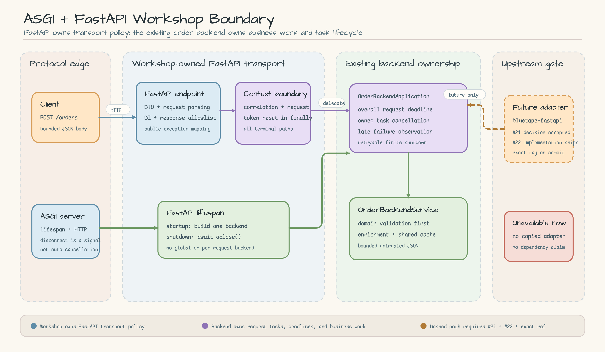
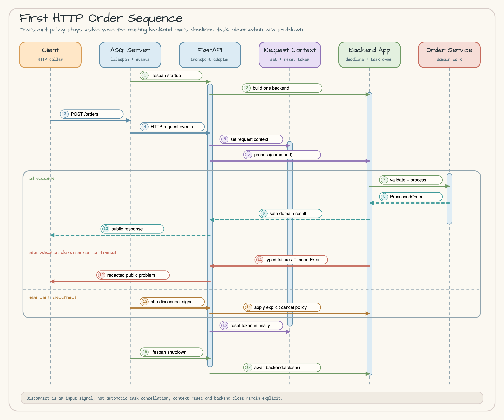

# ASGI와 FastAPI Workshop 경계

[English](README.md) | 한국어

이 연구 결정은 `bluetape-py-workshop`의 첫 HTTP 예제가 지켜야 할 경계를 정의합니다.
FastAPI, ASGI adapter, 새로운 `bluetape-py` package를 추가하지 않습니다. 현재의
framework-neutral `OrderBackendApplication`이 business와 request lifecycle의 중심으로
남습니다.

결정일: **2026-07-16**.

## 1분 요약

첫 HTTP 예제는 **Direct FastAPI**를 사용합니다. Workshop이 소유하는
`POST /orders` transport가 기존 통합 주문 backend에 위임합니다. FastAPI request
model, request parsing, dependency injection, request-context reset, public exception
mapping, response shaping, client disconnect 정책, timeout mapping, lifespan wiring은
예제에 명시적으로 둡니다.

**Raw ASGI**부터 시작하지 않습니다. 학습자가 `bluetape-py` 경계를 보기 전에
routing, body 조립, validation, response framing을 직접 구현하게 되기 때문입니다.
아래 채택 gate를 통과하기 전에는 **Future `bluetape-fastapi`** 지원도 주장하지
않습니다.

## 권장 시나리오

Partner가 [통합 주문 backend](../../../examples/integrated_order_backend/README.ko.md)와
같은 aggregate를 `POST /orders`로 전송합니다. HTTP layer는 transport shape를
검증하고 `OrderBackendCommand`를 만듭니다. `OrderBackendApplication`은 전체 request
deadline, task observation, business processing, retry 가능한 유한 close를 소유합니다.

첫 HTTP 예제는 다음을 증명해야 합니다.

- FastAPI lifespan startup에서 application instance 하나를 만든다.
- HTTP request 하나가 `OrderBackendApplication.process()`에 위임된다.
- validation과 domain failure를 provider message나 encoded artifact를 노출하지 않는
  안정적인 public response로 변환한다.
- timeout과 caller-cancellation 정책을 명시한다.
- request context를 항상 `finally`에서 reset한다.
- lifespan shutdown이 `OrderBackendApplication.aclose()`를 기다린다.

Authentication, persistence, production deployment, 자동 disconnect cancellation,
재사용 가능한 framework middleware는 이 첫 예제의 non-goal입니다.

## Architecture

[Architecture SVG source 열기](images/architecture.svg).

이 그림은 순서도가 아니라 책임 지도입니다. Workshop이 FastAPI transport를
소유하고 기존 backend가 business와 task lifecycle을 소유합니다. 점선으로 표시한
미래 경로는 두 upstream gate를 모두 통과할 때까지 사용할 수 없습니다.

## Sequence Diagram

[Sequence Diagram SVG source 열기](images/sequence.svg).

ASGI server는 `http.disconnect`를 보낼 수 있지만 specification은 application work가
자동으로 cancel된다고 보장하지 않습니다. Adapter는 정책상 필요할 때 signal을
관찰하고 자신이 소유한 work만 cancel하며 context를 반드시 reset해야 합니다.
Disconnect 뒤에는 response send도 실패할 수 있으므로 public error mapping은
response를 쓸 수 있다는 가정에 의존하면 안 됩니다.

## 대안 비교

| 대안 | 장점 | 단점 | 결정 |
|---|---|---|---|
| Direct FastAPI | 현실적인 학습 API이며 native DTO validation, DI, error handler, lifespan을 사용한다 | Framework 개념이 workshop 소유로 남고 미래 adapter가 경계를 바꿀 수 있다 | **첫 예제로 사용** |
| Raw ASGI | Protocol event와 disconnect 동작이 완전히 드러나며 framework dependency가 없다 | Routing, body buffering, validation, error, response glue를 중복 구현해 `bluetape-py` 학습을 흐린다 | 고급 protocol 연습으로 유지 |
| Future `bluetape-fastapi` | Problem Details, request context, middleware composition, conformance behavior를 표준화할 수 있다 | Package와 contract가 아직 없으며 성급한 사용은 workshop이 사실상 API를 소유하게 만든다 | 아래 정확한 gate 뒤 채택 |

Direct FastAPI가 첫 수업에 가장 현실적입니다. 학습자가 실제 service에서 사용할
가능성이 높은 경계를 바로 보기 때문입니다. Raw ASGI는 protocol 자체가 학습 목표일
때 가치가 있습니다. 미래 adapter는 upstream이 재사용 정책과 테스트를 소유한 뒤에만
유용합니다.

## Ownership Matrix

| 관심사 | Workshop FastAPI transport | 기존 backend | 미래 upstream adapter |
|---|---|---|---|
| request parsing | Pydantic/FastAPI DTO와 제한된 `OrderBackendCommand` 변환 | 잘못된 domain aggregate 거부 | 일반 helper는 가능하지만 domain DTO는 소유하지 않음 |
| dependency injection | FastAPI dependency/app state로 backend 연결 | 명시적인 collaborator 수신 | Framework hook을 표준화할 수 있음 |
| request-context reset | Correlation/request context를 열고 `finally`에서 reset | Service-level context contract 보존 | Conformance test 뒤 reusable context middleware 가능 |
| public exception mapping | 알려진 exception만 안정적인 status/body로 mapping하고 내부 정보 redaction | Typed domain/lifecycle exception 발생 | RFC 7807 primitive와 handler 가능 |
| response shaping | Public allowlist 구성, encoded artifact data와 provider detail 제외 | Domain result와 안전한 metadata 반환 | 일반 Problem Details serialization 가능 |
| client disconnect | 필요할 때 `http.disconnect`를 관찰하고 owned work cancellation 여부 결정 | Caller cancellation에 올바르게 반응하고 late failure 관찰 | 검증된 disconnect/cancellation middleware 가능 |
| timeout | HTTP-facing budget 선택과 native `TimeoutError` mapping | 전체 backend deadline과 owned task cancellation 강제 | Domain budget을 대체하지 않는 generic timeout hook 가능 |
| lifespan과 cleanup | Startup에 backend 하나 생성, shutdown에 `aclose()` 호출 | Request/close task와 retry 가능한 유한 shutdown 소유 | Application resource 정책이 아닌 registration helper 가능 |

## 경계 규칙

1. Transport validation과 domain validation을 분리합니다. FastAPI가 잘못된 JSON
   shape를 거부해도 backend는 provider I/O 전에 전체 주문을 다시 검증합니다.
2. Dependency injection은 application-owned resource를 연결합니다. Global backend를
   숨기거나 request마다 backend를 만들면 안 됩니다.
3. Request context는 token/context-manager 경계를 사용하고 success, error, timeout,
   cancellation 모두에서 `finally`로 reset합니다.
4. Public exception mapping은 명시적 allowlist입니다. 모르는 failure는 generic server
   problem으로 바꾸고 request secret 없이 log합니다.
5. Client disconnect는 signal이지 자동 cancellation 보장이 아닙니다. Cancellation
   policy는 task owner를 지목하고 cleanup을 보존해야 합니다.
6. 바깥 HTTP timeout이 backend work를 detach하면 안 됩니다. 기존 backend deadline이
   task lifecycle의 authoritative boundary입니다.
7. FastAPI lifespan이 construction과 shutdown을 소유합니다. Startup 완료 뒤 request를
   받고 shutdown은 backend close contract를 기다립니다.

## `bluetape-fastapi` 채택 Gate

Framework-specific 채택에는 다음 조건이 모두 필요합니다.

1. [bluetape-py #21](https://github.com/bluetape4k/bluetape-py/issues/21)이
   package와 ownership 결정으로 승인된다.
2. [bluetape-py #22](https://github.com/bluetape4k/bluetape-py/issues/22)가
   conformance-tested ASGI/FastAPI behavior를 제공한다.
3. Workshop이 해당 구현을 포함한 **exact stable release tag or commit**을 pin한다.
   Open issue, branch name, 움직이는 `develop` head는 충분하지 않다.
4. Adapter가 위 ownership matrix를 보존하고 optional web dependency를 얇은 default
   `bluetape-py` install에 끌어오지 않는다.
5. HTTP 예제를 다국어 문서, Architecture, Sequence Diagram, 테스트, migration note와
   함께 한 번의 review된 변경으로 갱신한다.

그전까지 FastAPI는 workshop-only이며 이 저장소에 reusable adapter를 복사하지
않습니다.

## 선행 학습 예제

- [검증된 주문 접수](../../../examples/order_intake/README.ko.md): domain normalization과
  validation.
- [통합 주문 backend](../../../examples/integrated_order_backend/README.ko.md): request
  deadline, task observation, shared cache composition, bounded JSON, shutdown.
- Primary specification의 ASGI lifespan과 HTTP/disconnect semantics.
- Business abstraction이 아니라 transport tool로 사용하는 FastAPI lifespan,
  dependencies, exception handler.

## Primary Sources

모든 source는 **2026-07-16**에 확인했습니다.

- [ASGI Lifespan](https://asgi.readthedocs.io/en/latest/specs/lifespan.html)
- [ASGI HTTP and WebSocket](https://asgi.readthedocs.io/en/latest/specs/www.html)
- [Starlette Lifespan](https://www.starlette.io/lifespan/)
- [Starlette Requests](https://www.starlette.io/requests/)
- [FastAPI Lifespan Events](https://fastapi.tiangolo.com/advanced/events/)
- [FastAPI Dependencies](https://fastapi.tiangolo.com/tutorial/dependencies/)
- [FastAPI Error Handling](https://fastapi.tiangolo.com/tutorial/handling-errors/)
- [Workshop Issue #9](https://github.com/bluetape4k/bluetape-py-workshop/issues/9)

## Scope Result

이 이슈는 경계 결정만 기록합니다. Python source, dependency, lockfile, runtime,
package, release, milestone state를 바꾸지 않습니다. 첫 HTTP 예제는 이 결정을 승인한
뒤 별도 implementation issue로 추적해야 합니다.
