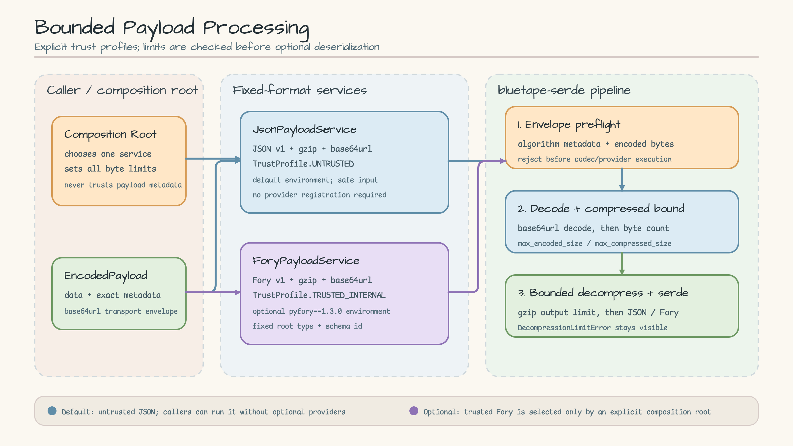
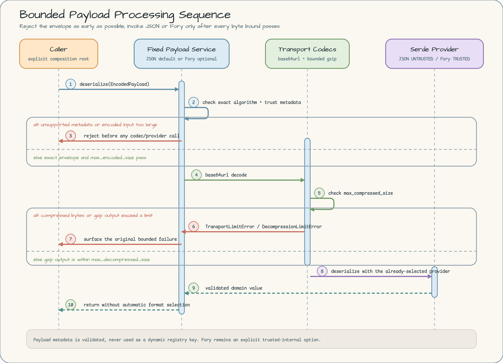

# 제한 기반 Payload 처리

[English](README.md) | 한국어

전송 envelope의 선언 형식과 모든 byte 경계를 먼저 검사한 뒤에만 역직렬화하는 애플리케이션형 예제입니다. default 경로는 `TrustProfile.UNTRUSTED` JSON을 사용하고, optional 격리 환경은 `TrustProfile.TRUSTED_INTERNAL` Apache Fory와 `pyfory==1.3.0`을 사용합니다.

## Scenario

주문 서비스가 압축 payload를 base64url 문자열로 저장하거나 전달한다고 가정합니다. 악의적이거나 잘못 설정된 송신자는 metadata를 위조하고, 지나치게 큰 인코딩 데이터를 보내고, 작은 gzip 입력 안에 큰 본문을 숨기거나, 수신자가 강력한 역직렬화기를 선택하도록 유도할 수 있습니다.

그래서 composition root가 payload를 받기 전에 고정 서비스 하나를 선택합니다.

- `JsonPayloadService`는 신뢰할 수 없는 JSON 문서를 위한 default입니다.
- `ForyPayloadService`는 optional이며, 신뢰된 내부 경계에서 고정된 `OrderSnapshot` 등록만 허용합니다.
- 두 서비스 모두 payload metadata를 이용한 automatic 형식 선택을 하지 않습니다. metadata가 신뢰 경계를 통과한다면 외부 프로토콜에서 authenticated 상태여야 하며, authenticated metadata라도 이미 선택한 서비스의 고정 계약과 대조하여 검증합니다.

## Architecture

[](docs/images/architecture.svg)

정책 결정은 호출자가 소유합니다. 두 서비스는 정확한 metadata, `gzip`, `base64url`을 담은 `EncodedPayload` 전송 형태를 함께 사용하지만 동적 provider registry를 공유하지 않습니다. decode 경로는 `max_encoded_size`, `max_compressed_size`, 압축 해제/직렬화 크기 제한 순으로 확인한 뒤 JSON 또는 Fory를 호출합니다.

## Sequence Diagram

[](docs/images/sequence.svg)

조기 거부 분기도 계약의 일부입니다. 지원하지 않는 encoding, compression, metadata는 codec 실행 전에 실패합니다. 인코딩 또는 압축 크기 초과는 `TransportLimitError`, 제한된 gzip 확장 초과는 그대로 `DecompressionLimitError`로 드러나며, 모든 제한을 통과한 값만 역직렬화 단계에 도달합니다.

## 제한 모델

| 경계 | 검사 시점 | 목적 |
| --- | --- | --- |
| `max_encoded_size` | base64url decode 전 | 호출자에게 받은 전송 문자열 크기를 제한합니다. |
| `max_compressed_size` | decode 후, gzip 확장 전 | 압축 byte buffer 크기를 제한합니다. |
| JSON `max_serialized_size` / Fory `ForyLimits.max_input_size` | 제한된 gzip 출력 및 역직렬화 중 | 압축 폭탄과 과도하게 큰 직렬화 입력을 방지합니다. |
| JSON `max_nesting_depth` | JSON 직렬화/역직렬화 중 | 병적으로 깊은 문서를 거부합니다. |

모든 제한은 양의 exact integer여야 합니다. gzip 출력 제한은 후속 역직렬화기 입력 제한을 넘을 수 없습니다.

## default JSON 예제 실행

CPython 3.13과 `uv`가 필요합니다. 잠금된 기본 개발 환경은 의도적으로 `pyfory`를 설치하지 않습니다.

```bash
uv sync --locked --python 3.13.14
uv run --locked python -m examples.bounded_payload_processing
uv run --locked pytest examples/bounded_payload_processing/tests/test_service.py \
  examples/bounded_payload_processing/tests/test_application.py -q
```

CLI는 metadata와 크기만 출력하고 payload 본문은 출력하지 않습니다. 마지막 이벤트는 잘못된 base64url 입력이 거부되는 모습을 보여 줍니다.

## optional Fory 예제 실행

저장소의 provider baseline 테스트가 default 환경에 provider가 없음을 증명할 수 있도록 Fory를 격리합니다.

```bash
UV_PROJECT_ENVIRONMENT=.venv-fory uv sync --locked --extra fory --python 3.13.14
source .venv-fory/bin/activate
python -m examples.bounded_payload_processing.fory_demo
pytest examples/bounded_payload_processing/tests/test_fory_service.py -q
deactivate
rm -rf .venv-fory
```

`ForyPayloadService`는 고정 Fory metadata, root type, schema ID, type ID, 제한을 검증합니다. 이 trusted-internal 프로필을 임의의 네트워크 입력에 노출하지 마십시오.

## Source map

- [`models.py`](models.py) — 불변 전송 envelope와 Fory `OrderSnapshot` 도메인 모델.
- [`errors.py`](errors.py) — 명시적인 전송 알고리즘 및 크기 제한 오류.
- [`service.py`](service.py) — 고정된 untrusted metadata와 제한 codec을 사용하는 default JSON 서비스.
- [`fory_service.py`](fory_service.py) — 고정된 trusted-internal metadata를 사용하는 optional Fory 서비스.
- [`__main__.py`](__main__.py) — 결정적인 JSON CLI.
- [`fory_demo.py`](fory_demo.py) — 명시적인 Fory composition root와 등록.
- [`tests`](tests) — 경계, 실패 순서, provider 격리, CLI, 문서 테스트.

## 설계 참고

- Provider 선택은 데이터가 아니라 코드입니다. 애플리케이션이 신뢰할 서비스를 직접 import하고 구성합니다.
- Metadata preflight는 base64url decode, gzip 압축 해제, provider 실행보다 먼저 수행됩니다.
- Fory는 default package initializer에서 다시 export하지 않으므로 JSON 예제 import가 optional provider를 끌어오지 않습니다.
- `OrderSnapshot`은 mutable slotted dataclass입니다. `pyfory==1.3.0`이 frozen slotted 변형을 역직렬화하지 못하기 때문이며, 서비스가 호출자 입력을 보존한다는 사실은 테스트로 검증합니다.
