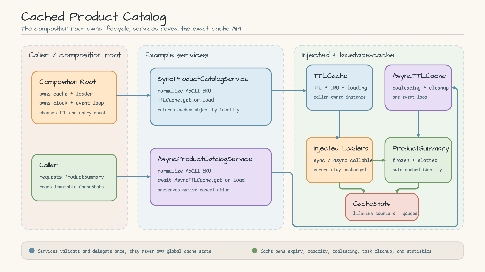
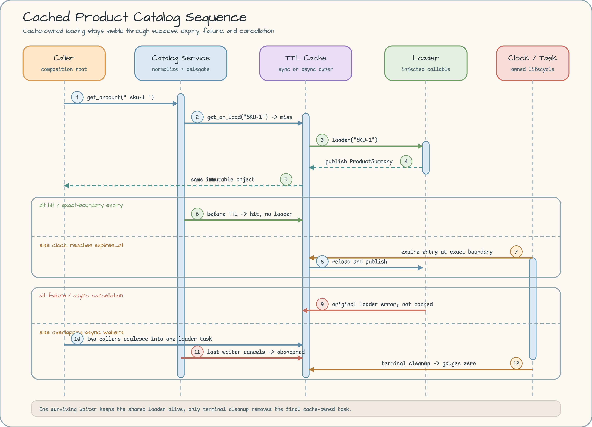

# 캐시 기반 상품 카탈로그

[English](README.md) | 한국어

이 실행 가능한 예제는 호출자가 소유한 로컬 TTL 캐시로 상품 로더를
감쌉니다. 워크숍 전용 추상화 뒤에 숨기지 않고 캐시 소유권, 수명주기
카운터, 장애 복구, asyncio 취소를 그대로 보여 줍니다.

## Scenario

상품 카탈로그가 불변 상품 요약을 반복해서 읽는 상황입니다. 첫 조회는
캐시 `miss`로 기록되어 주입된 로더를 호출하고, 반복 조회는 `hit`가
됩니다. 수동 시계로 정확한 `expiry` 경계를, 두 항목 용량으로 LRU
`eviction`을 확인합니다. 로더 실패는 그대로 전파되지만 캐시되지 않으므로
다음 호출에서 복구할 수 있습니다.

다루지 않는 범위:

- Redis, 분산 조정, near-cache 무효화, 영속화;
- HTTP, ASGI, 공급자 SDK, 재시도, 백그라운드 만료 작업;
- 전역 캐시, 싱글턴, 서비스 로케이터, 워크숍 캐시 어댑터;
- 네트워크, Docker, 자격 증명, 실제 시간 의존성.

## Architecture



[Architecture SVG 원본 열기](docs/images/architecture.svg).

조립 지점(composition root)이 캐시, 로더, 시계, event loop를 소유합니다.
`SyncProductCatalogService`에는 `TTLCache`를,
`AsyncProductCatalogService`에는 `AsyncTTLCache`를 주입합니다. 두 서비스는
키를 한 번 정규화하고 대응하는 공개 캐시 API를 한 번 호출한 뒤 같은
불변 `ProductSummary` 객체를 반환합니다. 호출자는 `CacheStats` 스냅샷을
직접 읽을 수 있습니다.

| 구성 요소 | 소유자 | 책임 |
|---|---|---|
| 조립 지점 | 호출자 | 캐시, 로더, 시계, 비동기 수명주기 생성 |
| 동기/비동기 카탈로그 서비스 | 예제 | 상품 ID 정규화와 한 번의 위임 |
| `TTLCache` / `AsyncTTLCache` | 호출자와 `bluetape-cache` | TTL, LRU 용량, 로딩, coalescing, 통계 |
| 상품 로더 | 주입 어댑터 | 불변 `ProductSummary` 생성 |
| `ProductSummary` | 예제 | frozen, slotted, keyword-only 캐시 값 |

## Sequence Diagram



[Sequence Diagram SVG 원본 열기](docs/images/sequence.svg).

Sequence Diagram은 miss → loader → publish → return, 즉시 hit, 정확한
만료 경계와 재로딩, 실패 후 복구, 두 비동기 waiter가 하나의 로딩을
공유하는 과정, 취소 정리를 보여 줍니다. 한 waiter만 취소되면 살아 있는
waiter가 있으므로 로더는 취소되지 않습니다. 마지막 waiter가 취소되면
`CancelledError`가 그대로 전파되며, 느린 로더는 terminal cleanup이 끝날
때까지 잠시 abandoned 상태로 남을 수 있습니다.

## Packages and APIs

- `bluetape-cache`: `bluetape.cache.TTLCache`,
  `bluetape.cache.AsyncTTLCache`, `bluetape.cache.CacheStats`;
- `bluetape-core`: `bluetape.core.require_instance`,
  `bluetape.core.require_not_blank`;
- `bluetape-testing`: 테스트의 제한 시간 내 terminal cleanup 검증에 쓰는
  `bluetape.testing.eventually_async`.

패키지는 고정된 `bluetape-py` 커밋
[`4b7458f22cea0a9e757b5fbf7f5ff4bc8c23cb9a`](https://github.com/bluetape4k/bluetape-py/tree/4b7458f22cea0a9e757b5fbf7f5ff4bc8c23cb9a)에서
해결됩니다.

## Run

저장소 루트에서 Python 3.13.14와 잠금 환경을 준비합니다.

```bash
uv sync --locked --python 3.13.14
```

결정적인 인메모리 시나리오를 실행합니다.

```bash
uv run --locked python -m examples.cached_product_catalog
```

표준 출력에는 한 줄에 JSON 객체 하나가 기록됩니다. 대표 이벤트는 다음과
같습니다.

```json
{"event":"sync_miss","mode":"sync","name":"Mechanical Keyboard","price_cents":12500,"product_id":"SKU-1"}
{"event":"sync_hit","mode":"sync","name":"Mechanical Keyboard","price_cents":12500,"product_id":"SKU-1"}
{"error_code":"loader_unavailable","event":"sync_loader_failed","mode":"sync"}
```

명령은 로더 예외 원문이나 객체 표현을 출력하지 않습니다.

## Cache Lifecycle

| 조건 | 관찰되는 동작 |
|---|---|
| 유효 키 첫 조회 | `misses`, `loads`가 증가하고 로더 결과를 게시 |
| TTL 이전 반복 조회 | `hits`가 증가하고 정확히 같은 캐시 객체 반환 |
| 시계가 `expires_at` 도달 | `expirations` 증가, 다음 조회에서 재로딩 |
| 세 번째 LRU 항목 삽입 | `evictions` 증가, 가장 오래 미사용한 항목 제거 |
| 로더 예외 | 원래 예외 전파, `load_failures` 증가, 결과는 캐시하지 않음 |
| 같은 비동기 키가 겹침 | 로딩 하나만 실행, `coalesced_waiters` 증가 |
| 마지막 비동기 waiter 취소 | 원래 `CancelledError`, 정리 후 abandoned/inflight gauge는 0 |

`hits`, `misses`, `loads`, `load_failures`, `evictions`, `expirations`는
누적 lifetime counter입니다. `inflight_loads`, `abandoned_loads`,
`superseded_loads`는 시점별 gauge입니다. `clear()`는 항목을 제거하지만
누적 카운터는 초기화하지 않습니다.

## Ownership and Safety Boundaries

- 용량은 바이트가 아닌 entry count입니다. 실제 애플리케이션에서는 측정한
  값 크기를 바탕으로 제한을 정해야 합니다.
- 정규화 키는 최대 64자의 대문자 ASCII
  `[A-Z0-9][A-Z0-9._-]*`입니다. 잘못된 입력은 캐시와 로더에 도달하기
  전에 실패합니다.
- 실제 키에는 결과에 영향을 주는 tenant, 권한, locale, 정책 차원을 모두
  포함해야 합니다. 이 단일 tenant 예제는 해당 차원을 모델링하지 않습니다.
- 캐시 값은 객체 identity 그대로 반환됩니다. 예제의 frozen
  `ProductSummary`처럼 불변으로 유지하십시오.
- `AsyncTTLCache`는 처음 사용한 event loop에 결합됩니다. 하나의
  애플리케이션 루프 안에서 만들고 사용하며 여러 루프에서 재사용하지 않습니다.
- 서비스는 로더 예외, `CacheLoadLimitError`, `RecursiveLoadError`,
  `CancelledError`를 잡거나 변환하지 않으며 로그를 남기지 않습니다.
- 실제 telemetry를 추가할 때 원본 캐시 키, 값, 로더 예외 문구를 기록하지
  마십시오.

## Tests

이 예제만 독립적으로 실행합니다.

```bash
uv run --locked pytest examples/cached_product_catalog/tests -q
```

테스트는 시간 기반 sleep 대신 나노초 수동 시계와 asyncio event를 사용합니다.
동기/비동기 hit, miss, expiry, LRU eviction, 실패 복구, 호출자가 설정한
값의 identity, 비동기 성공/실패 공유, 부분 취소, 마지막 waiter 정리, CLI
출력, 언어 버전 동등성, 다이어그램 존재를 검증합니다.

## Cleanup and Troubleshooting

제거할 서버, 컨테이너, 파일, 백그라운드 서비스가 없습니다. 모든 캐시는
로컬이며 호출자가 소유하므로 프로세스 종료 시 해제됩니다.

- 모듈을 찾을 수 있도록 저장소 루트에서 명령을 실행하십시오.
- 의존성이 어긋나면 `uv sync --locked --python 3.13.14`를 다시 실행하십시오.
- 다른 event loop 오류가 발생하면 캐시를 하나의 `asyncio.run` 또는
  애플리케이션 루프 수명주기 안에서 만들고 사용하십시오.
- 로더 실패가 계속되면 주입한 공급자를 조사하십시오. 서비스는 의도적으로
  재시도를 추가하지 않습니다.
- Redis와 분산 무효화에는 별도의 예제와 설계가 필요합니다.

## Source

- [models.py](models.py) — 불변 캐시 상품 값
- [providers.py](providers.py) — 동기/비동기 로더 프로토콜
- [service.py](service.py) — 정규화와 한 번의 캐시 위임
- [__main__.py](__main__.py) — 결정적인 JSON 시나리오
- [tests](tests) — 동작, 취소, CLI, 문서, 다이어그램 검증
