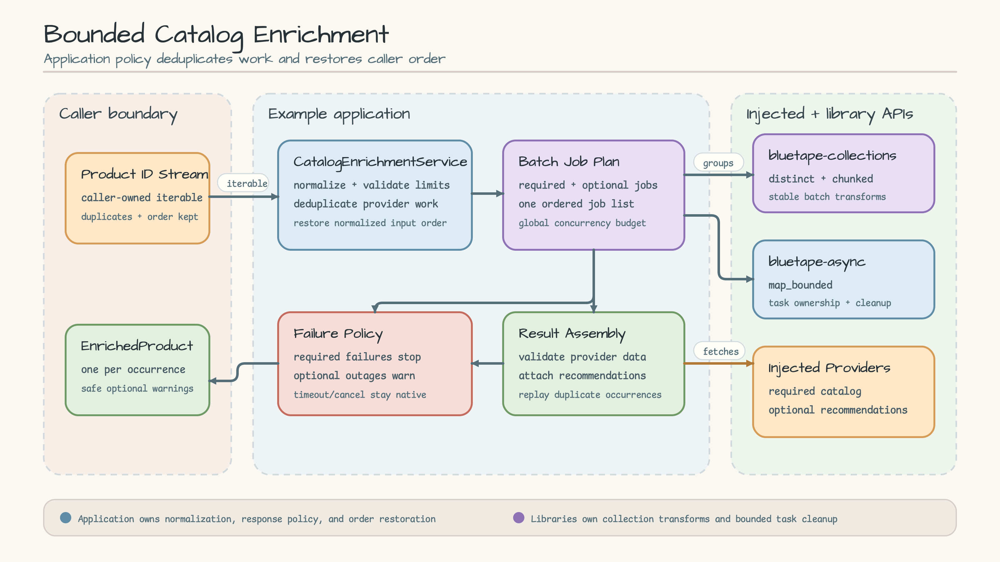
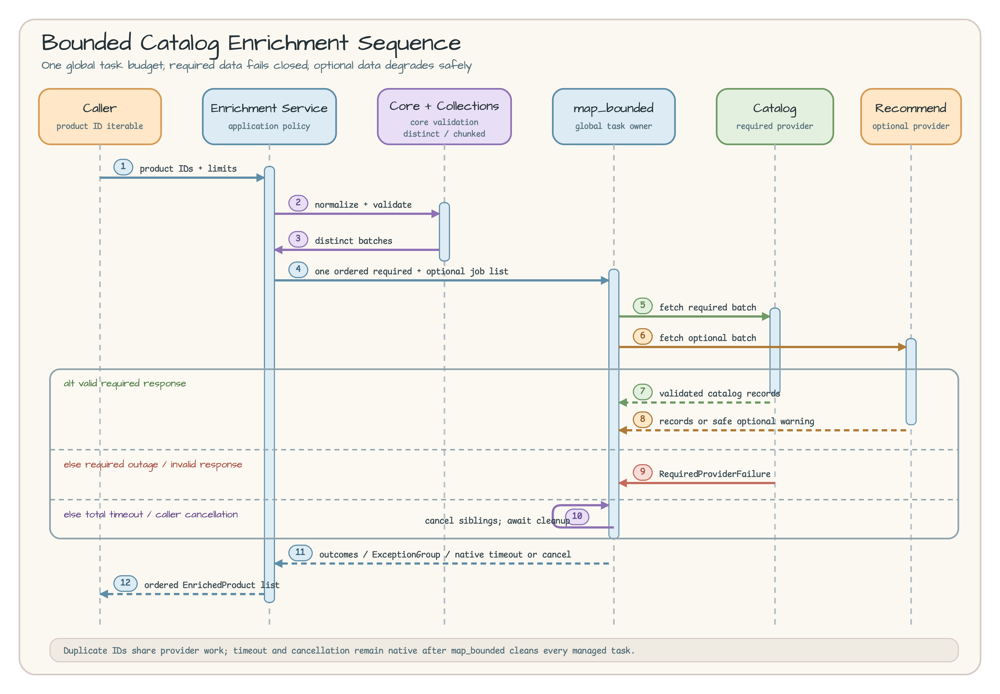

# Bounded Catalog Enrichment

English | [한국어](README.ko.md)

This runnable example composes a catalog and recommendation provider without
exceeding one shared concurrency limit. Duplicate product IDs are fetched once,
then results are restored in the caller's original order and occurrence count.

## Scenario

A product-listing application enriches each product ID with required catalog
data and an optional recommendation. Catalog data is required to build a
result; a recommendation outage becomes a safe warning while the catalog result
remains usable. Every provider job in one request shares the same concurrency
budget and total timeout.

Non-goals:

- no HTTP, ASGI, or FastAPI endpoint;
- no retry, cache, circuit breaker, or real provider client;
- no ownership of provider connection or session lifecycles;
- no Docker, network, credential, or background-service dependency.

## Architecture



[Open the Architecture SVG source](docs/images/architecture.svg).

| Component | Owner | Responsibility |
|---|---|---|
| `CatalogEnrichmentService` | Example | Input normalization, limits, provider response policy, and order restoration |
| `RequiredCatalogProvider` | Injected adapter | Required catalog records for each batch |
| `OptionalRecommendationProvider` | Injected adapter | Optional recommendations for each batch |
| `CatalogRecord` / `RecommendationRecord` | Example | Immutable provider response records |
| `EnrichedProduct` / `EnrichmentWarning` | Example | Immutable caller result and safe warning |
| `bluetape.collections.distinct` | `bluetape-collections` | Remove duplicate provider work while keeping first-seen order |
| `bluetape.collections.chunked` | `bluetape-collections` | Create fixed-size batches and validate batch size |
| `bluetape.asyncio.map_bounded` | `bluetape-async` | Own global concurrency, total timeout, task creation, and cleanup |

The application owns domain policy. `bluetape-py` supplies focused APIs for
validation, collection transforms, and bounded task lifecycle management.

## Sequence Diagram



[Open the Sequence Diagram SVG source](docs/images/sequence.svg).

The service trims each ID, validates its ASCII shape and length, and then
normalizes it to uppercase. `distinct` and `chunked` create provider batches.
Required and optional work enters one ordered list and one `map_bounded` call.
Provider work is shared for duplicate IDs; the final step creates one
`EnrichedProduct` for every normalized input occurrence.

## Packages and APIs

The runtime example uses:

- `bluetape-core`: `bluetape.core.require_instance` and
  `bluetape.core.require_not_blank`;
- `bluetape-collections`: `bluetape.collections.distinct` and
  `bluetape.collections.chunked`;
- `bluetape-async`: `bluetape.asyncio.map_bounded`.

All packages resolve from the pinned `bluetape-py` source commit
[`4b7458f22cea0a9e757b5fbf7f5ff4bc8c23cb9a`](https://github.com/bluetape4k/bluetape-py/tree/4b7458f22cea0a9e757b5fbf7f5ff4bc8c23cb9a).

## Run

From the workshop repository root, prepare the Python 3.13.14 environment:

```bash
uv sync --locked --python 3.13.14
```

Run the deterministic in-memory sample:

```bash
uv run --locked python -m examples.catalog_enrichment
```

Stdout is a JSON array ordered as `SKU-2`, `SKU-1`, `SKU-2`. Both `SKU-2`
results are equal. Because the recommendation provider omits `SKU-1`, that item
contains this warning:

```json
{
  "code": "optional_record_missing",
  "message": "recommendation is unavailable",
  "product_id": "SKU-1",
  "provider": "recommendations"
}
```

## Failure, Timeout, and Cancellation

| Condition | Public behavior |
|---|---|
| Required provider raises `ProviderUnavailable` | Convert to safe `CatalogEnrichmentFailed` |
| Required response has missing/extra keys or invalid records | Fail closed with `response_invalid` |
| Optional provider raises `ProviderUnavailable` | Add `optional_provider_failed` for each product |
| Optional record is missing or invalid | Add safe `optional_record_missing` / `optional_record_invalid` |
| Total timeout expires | Preserve native `TimeoutError` |
| Caller task is cancelled | Preserve native `CancelledError` |
| Provider raises an unexpected defect | Propagate the original `ExceptionGroup` |

On failure, `TimeoutError`, or `CancelledError`, `map_bounded` cancels its
sibling tasks and waits for cleanup before returning control to the caller. The
service therefore adds no semaphore or task registry of its own.

## Input and Trust Boundary

- One request accepts at most 1,000 input occurrences.
- After trimming, a product ID must be at most 64 ASCII characters, start with
  `[A-Z0-9]`, and use only `[A-Z0-9._-]` afterward.
- Batch size must be between 1 and 100.
- `concurrency_limit` must be between 1 and 1,024 and applies across every
  provider job.
- Provider mappings must match requested keys and each record's `product_id`.
- Provider exception details and invalid payload values never enter public
  errors or warnings.

The service emits no logs or metrics. If a real adapter adds telemetry, use
caller-owned safe IDs and aggregates; keep raw provider payloads out.

A real adapter should raise `ProviderUnavailable` only for expected operational
outages. Wrapping a programming defect in that exception would incorrectly turn
the defect into a warning.

## Tests

Run this example on its own:

```bash
uv run --locked pytest examples/catalog_enrichment/tests -q
```

Run the complete workshop gates:

```bash
uv run --locked ruff check .
uv run --locked ruff format --check .
uv run --locked pytest
```

The tests cover input limits, deduplication and order restoration, required and
optional response validation, one global concurrency limit, timeout, caller
cancellation, sibling-task cleanup, a network-free module entry point, and this
bilingual documentation contract.

## Cleanup and Troubleshooting

There is no server, container, file, or background process to stop or remove.
The command prints one in-memory sample and exits; Docker is not required.

- Run commands from the repository root so `examples.catalog_enrichment` is
  importable.
- If the environment drifts, rerun `uv sync --locked --python 3.13.14`; do not
  add a local editable override.
- If `TimeoutError` repeats, inspect the caller's total timeout together with
  `concurrency_limit` instead of hiding provider latency.
- The supported source is the pinned commit above, not an unpublished PyPI
  package path.

## Source

- [models.py](models.py) — immutable provider records and caller results
- [errors.py](errors.py) — safe public errors and required-failure metadata
- [providers.py](providers.py) — required and optional provider protocols
- [service.py](service.py) — validation, batching, bounded fan-out, and response policy
- [__main__.py](__main__.py) — independently runnable, network-free entry point
- [tests](tests) — behavior, lifecycle, application, and documentation checks
