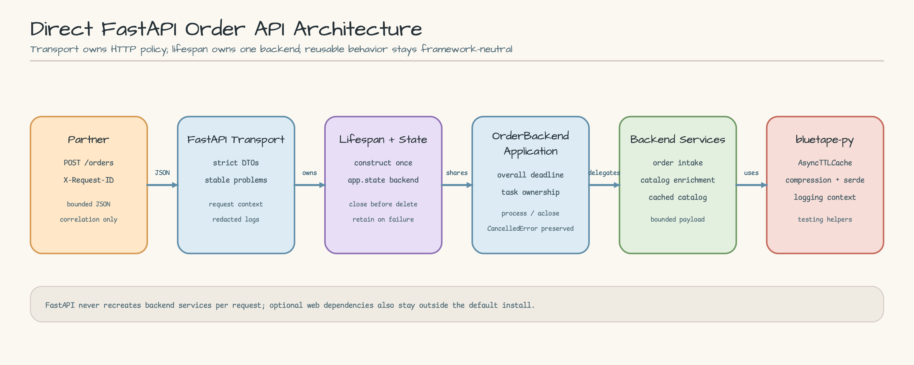
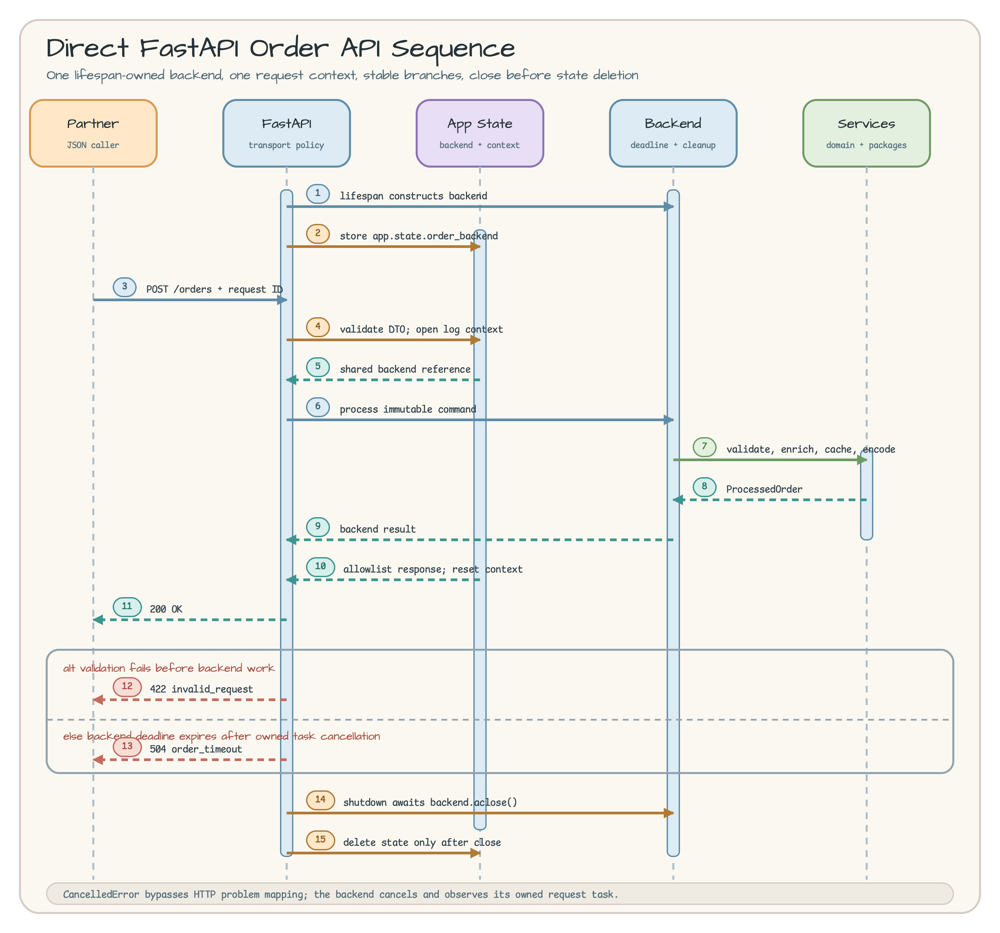

[English](README.md) | 한국어

# Direct FastAPI Order API

기존의 framework-neutral `OrderBackendApplication` 앞에 실제로 실행할 수
있는 Direct FastAPI transport를 붙이는 예제다. 학습자는 HTTP validation과
domain validation의 경계, lifespan이 소유하는 backend, 안정적인 오류 응답,
request context 정리를 한 흐름에서 확인할 수 있다.

## Scenario

파트너가 `POST /orders`로 주문을 보낸다. `X-Request-ID`는 로그와 응답을
연결하는 correlation 값일 뿐 idempotency key가 아니다. 같은 request ID로
재시도해도 중복 처리를 막아 주지 않으므로, 클라이언트는 request ID만 믿고
자동 retry하면 안 된다.

FastAPI는 bounded JSON DTO를 검사하고 immutable `OrderBackendCommand`로
변환한다. lifespan에서 딱 한 번 만든 `OrderBackendApplication`이 주문 접수,
catalog enrichment, `AsyncTTLCache`, `JsonPayloadService` 처리를 수행한다.
HTTP 응답은 provider 결과와 encoded artifact를 제외한 allowlist만 돌려준다.

지원하는 demo SKU는 다음 세 개다.

- `SKU-1`: Mechanical Keyboard, 12,500 cents
- `SKU-2`: Vertical Mouse, 7,900 cents
- `SKU-3`: USB-C Dock, 15,900 cents

## Architecture

[](docs/images/architecture.svg)

[Architecture SVG 원본](docs/images/architecture.svg) · [Architecture PNG](docs/images/architecture.png)

왼쪽 세 card는 Partner, FastAPI transport, lifespan/app state 경계다. 오른쪽
세 card는 framework-neutral backend와 재사용 service, bluetape-py package를
보여준다. card 간 간격은 14px arrowhead의 실제 투영 크기와 stroke, safety
margin보다 크고 connector는 card 내부를 지나지 않는다.

## Sequence Diagram

[](docs/images/sequence.svg)

[Sequence SVG 원본](docs/images/sequence.svg) · [Sequence PNG](docs/images/sequence.png)

Sequence Diagram은 lifespan startup, `POST /orders`, context open/reset, backend
deadline, `422`/`504` branch, shutdown의 `aclose()`와 state 삭제 순서를 함께
보여준다. `CancelledError`는 HTTP problem으로 바꾸지 않고 그대로 전파한다.

## Prerequisites and Setup

저장소 root에서 Python 3.13.14와 `uv`를 사용한다. FastAPI, HTTPX, Uvicorn은
default install에 들어가지 않는 optional extra다. 다음 명령은 별도의
`.venv-fastapi`를 만들며 Redis와 Apache Fory optional lane을 건드리지 않는다.

```bash
UV_PROJECT_ENVIRONMENT=.venv-fastapi uv sync --locked --extra fastapi-order-api --python 3.13.14
```

workshop은 bluetape-py의 pinned source commit을 사용한다. upstream의 재사용
가능한 adapter 연구인 [bluetape-py/issues/21](https://github.com/bluetape4k/bluetape-py/issues/21)과
[bluetape-py/issues/22](https://github.com/bluetape4k/bluetape-py/issues/22)는
아직 별도 gate다. 이 예제는 미래의 `bluetape-fastapi` API를 흉내 내지 않는다.

## Run

loopback 전용 개발 server를 실행한다. host, worker 수, reload, proxy trust는
CLI에서 바꿀 수 없다.

```bash
UV_PROJECT_ENVIRONMENT=.venv-fastapi uv run --locked --extra fastapi-order-api python -m examples.fastapi_order_api --port 8000
```

다른 terminal에서 정확히 한 주문을 보낸다.

```bash
curl --fail-with-body \
  -X POST http://127.0.0.1:8000/orders \
  -H 'Content-Type: application/json' \
  -H 'X-Request-ID: req-1001' \
  -d '{
    "partner_id": "partner-7",
    "order_id": "order-9001",
    "lines": [
      {"sku": "SKU-1", "quantity": 2},
      {"sku": "SKU-2", "quantity": 1}
    ]
  }'
```

정상 결과는 `200 OK`이며 shape은 다음 allowlist와 같다.

```json
{
  "request_id": "req-1001",
  "partner_id": "partner-7",
  "order_id": "order-9001",
  "line_count": 2,
  "total_cents": 32900,
  "warning_count": 0
}
```

## Ownership and Lifecycle

- `create_app()`의 lifespan이 backend factory를 한 번 호출한다.
- 모든 요청은 같은 `app.state.order_backend`를 빌린다.
- FastAPI transport는 HTTP DTO, status, public message, redacted log만 소유한다.
- `OrderBackendApplication`은 2초 overall deadline과 request task 정리를 소유한다.
- shutdown은 `await backend.aclose()`가 성공한 다음에만 state를 삭제한다.
- `OrderBackendShutdownError`가 발생하면 예외를 숨기지 않고 state를 남긴다.

endpoint에 별도의 timeout이나 client-disconnect watcher를 추가하지 않았다.
caller cancellation은 `CancelledError`로 전파되고 backend가 소유한 task를
cancel하고 관찰한다.

## Validation and Failure Contract

`Content-Type: application/json`만 허용하고 charset parameter는 허용한다.
`X-Request-ID`는 trim 뒤 1..128자의 ASCII `[A-Za-z0-9._:-]`여야 하며 중복
header도 거부한다. request body는 unknown field를 금지하고 identifier는
1..128자, lines는 1..100개, strict integer quantity는 1..1,000,000이다.

공백뿐인 identifier는 transport 길이 검사를 통과한 뒤 domain에서
`invalid_order`로 거부된다. 이 구분 덕분에 domain rule을 Pydantic에
복제하지 않는다.

| HTTP | code | 의미 |
| ---: | --- | --- |
| 422 | `invalid_request` | header, JSON, DTO validation 실패 |
| 422 | `invalid_order` | 완전한 domain validation 실패 |
| 503 | `catalog_unavailable` | required catalog provider 사용 불가 |
| 503 | `backend_unavailable` | backend가 이미 닫힘 |
| 504 | `order_timeout` | backend overall deadline 만료 |
| 500 | `order_processing_failed` | payload/compression/serde 처리 실패 |
| 500 | `internal_error` | 예상하지 못한 내부 실패 |

모든 problem은 `code`, `message`, `request_id`만 기본으로 포함하고 안전한
경우에만 `field`, `line_index`를 더한다. raw input, Pydantic message,
provider exception, artifact byte, stack trace는 응답이나 transport log에
넣지 않는다.

## Security and Production Boundaries

이 코드는 workshop용 loopback server다. authentication, authorization,
persistence, TLS, rate limiting, production worker topology를 제공하지 않는다.
`proxy_headers=False`이므로 reverse proxy의 forwarded identity도 신뢰하지
않는다.

Pydantic bound는 decode된 model만 제한한다. Uvicorn이 validation 전에 읽는
raw HTTP body byte에는 이 예제가 body limit을 걸지 않는다. production에
적용하려면 gateway나 reverse proxy에서 엄격한 request body limit,
authentication, authorization, rate limit을 먼저 강제해야 한다.

`X-Request-ID`는 correlation이지 idempotency가 아니며 secret을 넣어서는 안
된다. `503`이나 `504`를 받았다고 같은 주문을 자동 retry하면 중복 처리될 수
있다.

## Packages and APIs

- FastAPI: lifespan, `RequestValidationError`, explicit response model
- Uvicorn: fixed `127.0.0.1`, one worker, reload/proxy disabled
- `bluetape.logging`: `log_context`, `ContextLogFilter`
- `bluetape.cache`: `AsyncTTLCache`
- `bluetape.compression` / `bluetape.serde`: bounded payload pipeline
- `bluetape.testing`: event-driven `eventually_async` cancellation proof

## Tests

optional environment에서 전체 예제 테스트를 실행한다.

```bash
UV_PROJECT_ENVIRONMENT=.venv-fastapi uv run --locked --extra fastapi-order-api pytest examples/fastapi_order_api/tests -q
```

default environment의 전체 collection은 FastAPI test module을 명시적으로
skip하며 web package가 설치되지 않았다는 dependency baseline도 별도로
검사한다.

```bash
uv run --locked pytest -q
uv run --locked pytest tests/test_dependency_baseline.py -q
```

## Cleanup and Troubleshooting

- server 중지: 실행 중인 terminal에서 `Ctrl+C`
- `address already in use`: 빈 port를 골라 `--port 18080`처럼 다시 실행
- `ModuleNotFoundError: fastapi`: `.venv-fastapi` setup 명령을 다시 실행
- `422 invalid_request`: `Content-Type: application/json`과 단일
  `X-Request-ID`, strict JSON field를 확인
- `422 invalid_order`: 공백 identifier나 완전한 domain invariant를 확인
- `503 catalog_unavailable`: `SKU-1`, `SKU-2`, `SKU-3` 중 하나를 사용
- optional environment 삭제: `rm -rf .venv-fastapi`

이 예제는 production deployment recipe, reusable FastAPI adapter, database
API, authentication/authorization service, exactly-once retry protocol이 아니다.
