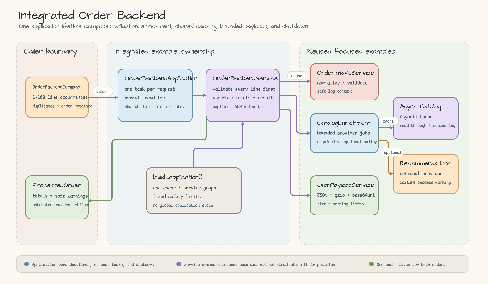
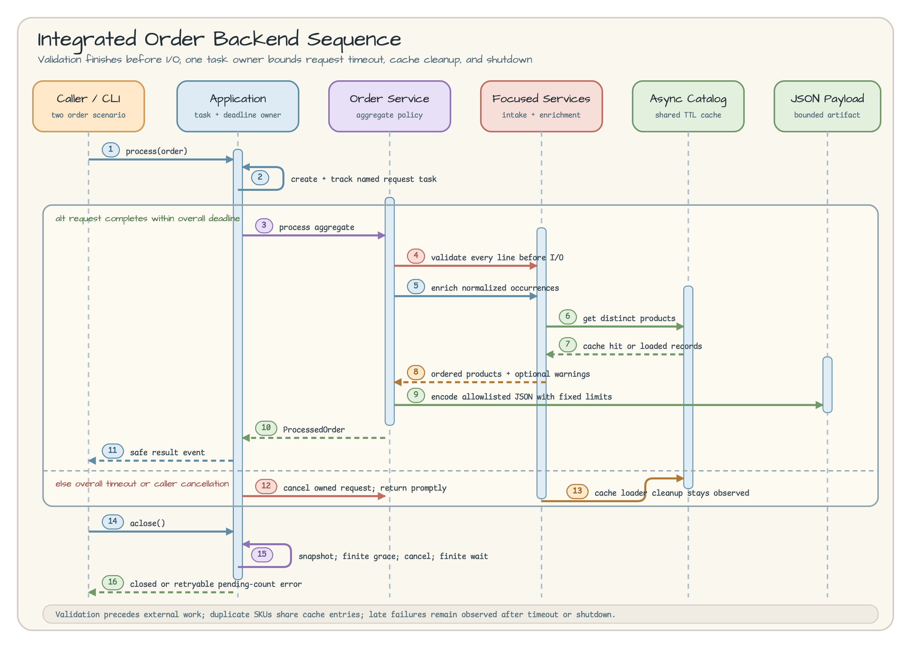

# Integrated Order Backend

English | [한국어](README.ko.md)

This runnable example composes the earlier focused examples into one realistic
order-processing flow. It validates a whole order before reading catalog data
through a cache, adds optional recommendations, creates a safe JSON artifact,
and lets one outer application own request deadlines and shutdown.

## Scenario

A partner submits an order with several line occurrences. The same SKU may
appear more than once in one order and again in a later order.

- First order: `SKU-1 x2`, `SKU-2 x1`, `SKU-1 x1` — total `45,400`.
- Second order: `SKU-2 x2`, `SKU-3 x1` — total `31,700`.
- Both orders use the same application and `AsyncTTLCache`.
- `SKU-2`, loaded for the first order, becomes a cache hit in the second.
- A missing recommendation record becomes a safe warning instead of failing
  the order.

The point is not to create a new framework. It is to keep the contracts of
already-tested focused services while composing them into an application-shaped
example.

## Architecture



[Open the Architecture SVG source](docs/images/architecture.svg).

| Component | Owned responsibility |
|---|---|
| `OrderBackendApplication` | Request tasks, overall request timeout, exception observation, shared close, and retry |
| `OrderBackendService` | Whole-order validation, occurrence order, totals, and explicit JSON document assembly |
| `OrderIntakeService` | Header, SKU, and quantity normalization and validation plus safe log context |
| `CatalogEnrichmentService` | Distinct-SKU provider work, required/optional policy, and occurrence restoration |
| `CachedCatalogProvider` | Sequential adapter from the existing async catalog to the enrichment provider |
| `AsyncProductCatalogService` / `AsyncTTLCache` | Read-through caching, concurrent-load coalescing, and public `CacheStats` |
| `JsonPayloadService` | Untrusted JSON, gzip, base64url, size limits, and nesting limits |
| `build_application()` | One cache and service graph per application composition root |

`build_application()` does not create a global cache. Two orders share a cache
inside one application context, while a new application receives a new cache.
This prevents test state from leaking and keeps lifecycle ownership explicit.

## Sequence Diagram



[Open the Sequence Diagram SVG source](docs/images/sequence.svg).

Admission checking, named request-task creation, and registration run without an
intervening `await`, so shutdown cannot miss already-admitted work in its
snapshot. The service validates every line with `OrderIntakeService` before it
starts enrichment I/O. Duplicate SKUs share provider work, but the result
restores the original occurrence order and quantities.

The application awaits its owned request through `asyncio.shield()` and applies
the overall deadline with an outer `asyncio.timeout()`. On timeout or caller
cancellation it cancels the owned task and returns promptly instead of waiting
without a bound. A done callback observes any late terminal exception.

## Packages and APIs

The integrated example reuses these `bluetape-py` APIs through the existing
focused examples:

- `bluetape-core`: exact-type and string validation for order input;
- `bluetape-logging`: `log_context` and `ContextLogFilter`;
- `bluetape-collections`: distinct SKU and stable batch construction;
- `bluetape-async`: bounded provider concurrency and cleanup;
- `bluetape-cache`: `AsyncTTLCache`, read-through loading, and `CacheStats`;
- `bluetape-compression`: bounded `GzipCompressor`;
- `bluetape-serde`: untrusted JSON metadata and serialization limits.

All packages resolve from the pinned `bluetape-py` source commit
[`4b7458f22cea0a9e757b5fbf7f5ff4bc8c23cb9a`](https://github.com/bluetape4k/bluetape-py/tree/4b7458f22cea0a9e757b5fbf7f5ff4bc8c23cb9a).

Fory remains a separate trusted-internal object-graph example in
[`bounded_payload_processing`](../bounded_payload_processing/README.md). This
order backend fixes its external artifact boundary to untrusted JSON and does
not let the caller select a format. Keeping Fory out of the external-input
boundary is an intentional security contract.

## Run

From the repository root, prepare the Python 3.13.14 environment:

```bash
uv sync --locked --python 3.13.14
```

Run the two-order scenario:

```bash
uv run --locked python -m examples.integrated_order_backend
```

Stdout contains exactly five sorted compact JSON lines:

1. `backend_started`
2. the first `order_processed`
3. the second `order_processed`
4. `cache_stats`
5. `backend_stopped`

The cache event reports `hits=1`, `misses=3`, `loads=3`, `load_failures=0`,
`inflight_loads=0`, and `abandoned_loads=0`. Order events contain only the line
count, total, warning count, artifact metadata, and encoded size. They exclude
product names, recommendations, artifact `data`, and provider exception text.

## Aggregate Invariants

- `OrderBackendCommand.lines` is an exact tuple with 1-100 occurrences.
- No cache, provider, or payload work begins until every line validates.
- The focused intake and catalog contracts trim, uppercase, and ASCII-validate
  each SKU.
- Duplicate SKUs share cache/provider work while line index, input order, and
  quantity remain intact.
- `total_cents` is the sum of every `unit_price_cents * quantity`.
- An explicit allowlist builds the artifact document; the artifact never
  recursively includes itself.
- The artifact metadata trust profile is always `untrusted`.

## Failure, Timeout, Cancellation, and Shutdown

| Condition | Public behavior |
|---|---|
| Invalid aggregate shape | `InvalidOrderBackendCommand`; no external work |
| Invalid line | Indexed `InvalidOrderLine`; original `InvalidOrderCommand` retained as the cause |
| Required catalog failure | Propagate `CatalogEnrichmentFailed`; failed load is not cached |
| Optional recommendation failure or omission | `optional_provider_failed` or `optional_record_missing` warning |
| Payload size, compression, or serde limit | Propagate the existing payload exception |
| Overall request timeout | Native `TimeoutError`; cancel the owned request |
| Caller cancellation | Native `CancelledError`; cancel the owned request |
| Work exceeds shutdown grace | Cancel once more and use a finite cancellation wait |
| Work keeps suppressing cancellation | `OrderBackendShutdownError` with pending count; retain references and allow retry |

Concurrent `aclose()` callers shield the same close task. Cancelling one close
waiter does not detach the shared close operation or request tasks. If a context
body fails and cleanup also cannot reach a terminal state, the body exception
remains primary and receives a cleanup note.

Application lifecycle telemetry is best-effort. A caller-provided logging
handler may fail without changing request registration, timeout behavior, or
shutdown state transitions. The application does not silently swallow the
existing `OrderIntakeService` logging contract inside the owned request task.

## Security and Production Boundaries

- Bound external identifiers by length and character set, and never log raw
  provider payloads.
- This teaching example briefly retains request, partner, and order identifiers
  in memory. A production service must define retention, deletion, and masking.
- The CLI has no authentication or authorization. A production adapter must
  verify that the partner may process the order and SKUs before I/O.
- Never copy provider exception messages or raw responses into public errors,
  warnings, or metric labels.
- Decode the JSON artifact as untrusted input and preserve encoded,
  compressed, serialized-size, and nesting-depth limits.
- HTTP/ASGI/FastAPI endpoints, database persistence, retries, circuit breakers,
  distributed caching, and tracing exporters are production non-goals here.

`CachedCatalogProvider` reads distinct SKUs sequentially to keep the teaching
flow explicit. Each order is capped at 100 lines, and the existing
enrichment/cache layers own provider concurrency. This example makes no
throughput or latency claim. If production latency matters, use measurements
and upstream API limits to justify a separate design.

## Tests

Run this example on its own:

```bash
uv run --locked pytest examples/integrated_order_backend/tests -q
```

Run the complete workshop gates:

```bash
uv run --locked ruff check .
uv run --locked ruff format --check .
uv run --locked pytest
```

The tests cover validation-before-I/O, duplicate occurrences, a shared cache
hit, loader recovery, optional warnings, payload limits, timeout, caller
cancellation, real cache-loader cleanup, concurrent close, cancellation-
resistant shutdown retry, event-loop binding, best-effort lifecycle logging,
CLI redaction, bilingual documentation, and the diagram contract.

## Cleanup and Troubleshooting

There is no server, container, file, or network connection to stop. The CLI
uses in-memory providers and the application context cleans up request and close
tasks when it exits.

- Run commands from the repository root.
- If the environment drifts, rerun `uv sync --locked --python 3.13.14`.
- Before hiding repeated `TimeoutError` with retries, inspect the request
  timeout, provider timeout, and cache-loader latency separately.
- On `OrderBackendShutdownError`, record the pending count, check whether a
  provider suppresses `CancelledError`, then retry close.
- If cache misses are unexpectedly high, check that you are not building a new
  application for every order.
- The supported source is the pinned commit above, not an unpublished PyPI
  package path.

## Source

- [models.py](models.py) — aggregate command and processed result
- [errors.py](errors.py) — validation, closed, and shutdown public errors
- [composition.py](composition.py) — cache adapter and fixed composition root
- [service.py](service.py) — validation-first processing and payload allowlist
- [application.py](application.py) — deadlines, task observation, and shared shutdown
- [__main__.py](__main__.py) — network-free two-order CLI
- [tests](tests) — behavior, lifecycle, CLI, and documentation checks
