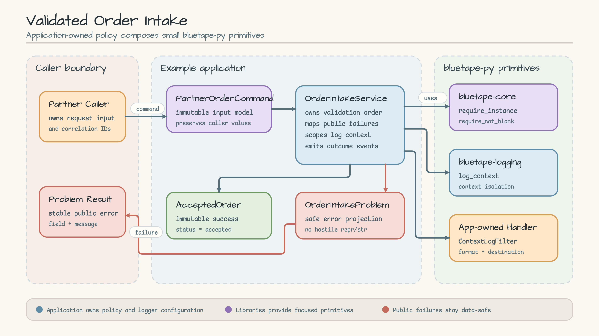
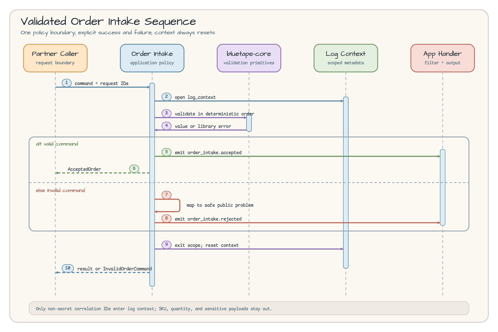

# Validated Order Intake

English | [한국어](README.ko.md)

This runnable example shows how an application composes small APIs from
`bluetape-core`, `bluetape-logging`, and `bluetape-testing` into a predictable
order-intake boundary.

## Scenario

A partner submits an order command with request, partner, order, SKU, and
quantity values. The application must validate those values in a deterministic
order, preserve accepted caller input, attach safe correlation IDs to log
records, and return either an immutable accepted order or a stable public
problem.

Non-goals:

- no HTTP, ASGI, FastAPI, database, queue, cache, or retry adapter;
- no credential, payment, inventory, or fulfillment processing;
- no shared workshop utility layer—the application owns its policy;
- no Docker dependency or background service.

## Architecture



[Open the Architecture SVG source](docs/images/architecture.svg).

| Component | Owner | Responsibility |
|---|---|---|
| `PartnerOrderCommand` | Example | Immutable input contract; caller values are not normalized or rewritten |
| `OrderIntakeService` | Example | Validation order, public error mapping, contextual events, accepted result |
| `AcceptedOrder` / `OrderIntakeProblem` | Example | Stable success and failure projections |
| `require_instance` / `require_not_blank` | `bluetape-core` | Focused runtime validation primitives |
| `log_context` | `bluetape-logging` | Scoped correlation metadata with automatic reset |
| `ContextLogFilter` and handler | Application entry point | Context injection, formatting, severity, and output destination |

The library packages provide focused primitives. The application remains
responsible for domain policy, validation order, error vocabulary, and logging
configuration.

## Sequence Diagram



[Open the Sequence Diagram SVG source](docs/images/sequence.svg).

Both paths open the same safe log context and validate fields in the same order.
The valid path emits `order_intake.accepted` and returns `AcceptedOrder`. The
invalid path maps the library exception to `InvalidOrderCommand`, emits
`order_intake.rejected`, and preserves the cause without evaluating hostile
values through `str()` or `repr()`. Exiting the context resets all correlation
metadata even when validation or logging raises.

## Packages and APIs

The runtime example uses:

- `bluetape-core`: `bluetape.core.require_instance` and
  `bluetape.core.require_not_blank`;
- `bluetape-logging`: `bluetape.logging.log_context` and
  `bluetape.logging.ContextLogFilter`;
- `bluetape-testing`: `bluetape.testing.eventually` in the focused tests.

The tests also use `bluetape.logging.get_log_context` to prove that context does
not leak across success, validation failure, or logger failure.

All packages resolve from the pinned `bluetape-py` source commit
[`4b7458f22cea0a9e757b5fbf7f5ff4bc8c23cb9a`](https://github.com/bluetape4k/bluetape-py/tree/4b7458f22cea0a9e757b5fbf7f5ff4bc8c23cb9a).

## Run

From the workshop repository root, prepare the locked Python 3.13.14
environment:

```bash
uv sync --locked --python 3.13.14
```

Run the deterministic sample:

```bash
uv run --locked python -m examples.order_intake
```

Expected stderr log:

```text
INFO order_intake.accepted request_id=request-1001 partner_id=partner-acme order_id=order-1001
```

Expected stdout JSON:

```json
{"order_id": "order-1001", "partner_id": "partner-acme", "quantity": 2, "request_id": "request-1001", "sku": "SKU-BLUE-42", "status": "accepted"}
```

## Tests

Run the example tests on their own:

```bash
uv run --locked pytest examples/order_intake/tests -q
```

Run the complete workshop gates:

```bash
uv run --locked ruff check .
uv run --locked ruff format --check .
uv run --locked pytest
```

The test suite covers accepted input, deterministic validation failures,
hostile values, contextual records, context reset, logger failure, the
`eventually` API, the module entry point, and this bilingual documentation
contract.

## Logging and Data Boundary

Only non-secret correlation identifiers—`request_id`, `partner_id`, and
`order_id`—enter log context. Never place credentials, tokens, personal data,
payment data, or sensitive payloads in those fields. Hash or replace an
identifier before constructing the command when its source is sensitive. SKU
and quantity are business payload fields and intentionally stay out of log
context.

The service never mutates the root logger. The entry point creates and removes
its own handler, and injected logger failures propagate after context cleanup.

## Cleanup and Troubleshooting

There is no server, container, file, or background process to stop or delete;
the command exits after one sample order. Docker is not required.

- Run commands from the repository root so `examples.order_intake` is importable.
- If dependency resolution drifts, rerun
  `uv sync --locked --python 3.13.14`; do not add a local editable override.
- The supported source is the pinned commit above, not the `v0.1.0` release tag
  or an unpublished PyPI package path.
- A validation error is an expected domain outcome. Inspect its `field` and
  stable message rather than logging the raw input value.

## Source

- [models.py](models.py) — immutable input and accepted output contracts
- [errors.py](errors.py) — public error type and safe problem mapping
- [service.py](service.py) — deterministic validation and contextual logging
- [__main__.py](__main__.py) — independently runnable application entry point
- [tests](tests) — behavior, isolation, application, and documentation checks
