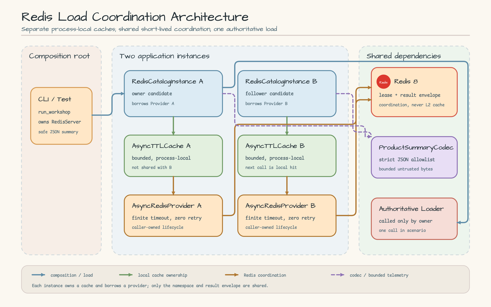
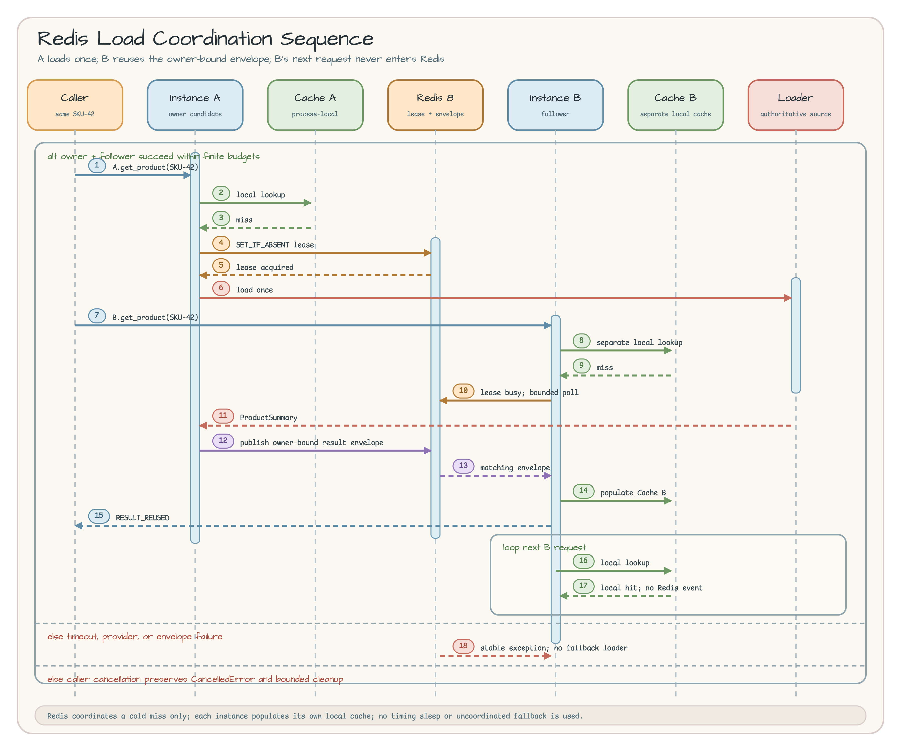

# Redis Load Coordination

[English](README.md) | 한국어

## Scenario

두 카탈로그 서비스 인스턴스가 같은 cold request `SKU-42`를 동시에
처리합니다. 각 인스턴스는 별도 `AsyncTTLCache`를 소유하므로 process-local
cache만으로는 두 인스턴스의 authoritative product loader 중복 호출을 막을
수 없습니다. 두 인스턴스는 각각 `AsyncRedisProvider`를 빌려 쓰고,
`AsyncRedisLoadCoordinator`를 통해 하나의 versioned coordination namespace를
공유합니다.

Instance A가 owner가 되어 한 번만 load하고 bounded result를 publish합니다.
Instance B는 active lease를 따라간 뒤 일치하는 published result를
`RESULT_REUSED`로 반환합니다. B의 다음 요청은 local hit이므로 Redis에
진입하지 않습니다. CLI는 안전한 counter와 outcome만 보여 줍니다.

```json
{"follower_local_hits": 1, "follower_outcome": "result-reused", "loader_calls": 1, "owner_outcome": "loaded", "product_id": "SKU-42"}
```

이 예제는 exact upstream commit
`4b7458f22cea0a9e757b5fbf7f5ff4bc8c23cb9a`의
`bluetape-cache-redis==0.1.0`을 사용합니다. Upstream provider 작업
[#54](https://github.com/bluetape4k/bluetape-py/issues/54)와 load coordination
[#55](https://github.com/bluetape4k/bluetape-py/issues/55)는 완료됐습니다.

## Architecture



[Architecture SVG source 열기](docs/images/architecture.svg).

`run_workshop`은 disposable `RedisServer` 하나를 소유합니다.
`run_scenario`는 `AsyncExitStack`으로 factory가 생성한 provider 두 개를
소유하고, 각 `RedisCatalogInstance`는 local cache를 소유하면서 provider를
빌려 씁니다. Upstream coordinator가 lease/snapshot/publish 동작을
소유합니다. `ProductSummaryCodec`은 strict untrusted JSON allowlist를,
`CoordinationEventRecorder`는 bounded terminal event만 소유합니다.

Local cache는 의도적으로 분리합니다. Redis에는 short-lived coordination
marker와 result envelope가 저장되며, L2 cache로 사용하지 않습니다.

## Sequence Diagram



[Sequence Diagram SVG source 열기](docs/images/sequence.svg).

Application은 A를 먼저 시작하고 loader admission을 기다립니다. 그다음 B를
시작하고 B의 bounded `SET_IF_ABSENT` 시도가 끝난 뒤 A를 release합니다.
이 event-driven 순서로 timing sleep 없이 owner/follower path를 증명합니다.
A가 publish하고 B가 `RESULT_REUSED`를 반환한 다음, B의 두 번째 호출은
provider event도 coordination event도 없는 local hit입니다.

## Public APIs Used

- `AsyncTTLCache`: 인스턴스별 bounded local cache;
- `AsyncRedisProvider`: 인스턴스별 caller-owned finite-timeout Redis client;
- `AsyncRedisLoadCoordinator`: cache-first distributed load coordination;
- `RedisLoadOptions`: versioned namespace, lease/result TTL, polling, attempt,
  wait, Redis I/O budget;
- `ResultEnvelopeCodec`: owner-token-bound result envelope;
- `ProductSummaryCodec`: 예제 전용 strict JSON payload codec; 그리고
- `RedisServer`: disposable Redis 8 integration infrastructure.

Package initializer는 dependency-free입니다. Extra 설치 후 explicit optional
submodule만 import하므로 default pytest collection은 Redis-provider-free 상태를
유지합니다.

## Run

준비물은 Python 3.13.14, uv 0.11.28, 접속 가능한 Docker runtime입니다.
Repository root에서 실행합니다.

```bash
UV_PROJECT_ENVIRONMENT=.venv-redis uv sync --locked \
  --extra redis-coordination --python 3.13.14

UV_PROJECT_ENVIRONMENT=.venv-redis uv run --locked \
  --extra redis-coordination python -m examples.redis_load_coordination
```

예상 field는 `loader_calls: 1`, owner `loaded`, follower `result-reused`,
`follower_local_hits: 1`입니다. Value, Redis key, token, endpoint, raw exception
text는 출력하지 않습니다.

Docker lane보다 deterministic test를 먼저 실행합니다.

```bash
UV_PROJECT_ENVIRONMENT=.venv-redis uv run --locked \
  --extra redis-coordination pytest -m "not testcontainers" \
  examples/redis_load_coordination/tests -q
```

Real Redis test는 sequential하게 단독 실행합니다.

```bash
UV_PROJECT_ENVIRONMENT=.venv-redis uv run --locked \
  --extra redis-coordination pytest -m testcontainers \
  examples/redis_load_coordination/tests/test_redis_integration.py -q
```

## Outcome and Failure Policy

| Outcome | Caller-visible policy |
|---|---|
| local hit | Local value를 반환하고 Redis command와 coordination event를 만들지 않습니다. |
| `LOADED` | Owner가 load하고 atomically publish한 뒤 자신의 local cache만 채웁니다. |
| `RESULT_REUSED` | Follower가 loader를 부르지 않고 matching envelope를 반환해 자신의 local cache를 채웁니다. |
| `LEASE_LOST` | Publish하지 않고 owner value를 해당 caller와 local cache에만 반환합니다. External duplicate load는 여전히 가능합니다. |
| timeout/provider/envelope failure | Stable upstream exception을 raise하며 uncoordinated loader로의 no fallback 원칙을 지킵니다. |
| loader failure | Original exception을 보존하고 best-effort cleanup은 static cleanup note만 추가할 수 있습니다. |
| cancellation | `asyncio.CancelledError`를 보존하고 cache flight와 coordinator가 bounded shielded cleanup을 수행합니다. |
| stale envelope | Owner-token mismatch를 반환하지 않고 poll budget 안에서 계속 진행하거나 bounded failure로 끝납니다. |

`AsyncExitStack`은 success, failure, cancellation 모두에서 provider 두 개를
역순으로 닫습니다. `RedisServer`는 CLI나 test body가 끝날 때 disposable
container를 닫습니다. Docker-backed path는 parallel이 아니라 sequential입니다.

## Security, Operations, and Cleanup

Bundled Docker Redis는 local test infrastructure이며 production recipe가
아닙니다. Production Redis는 `rediss://`, trusted CA, certificate와 hostname
verification, documented coordination key prefix/command만 허용하는 ACL
principal, finite connect/socket timeout, zero retry, no plaintext downgrade와
no fallback을 요구합니다.

Namespace와 key digest는 confidentiality가 아닌 pseudonym입니다. Namespace나
key에 secret 또는 sensitive identifier를 넣지 마세요. Terminal observation은
low-cardinality를 유지하며 raw key, value, token, endpoint, metadata,
exception text를 제외합니다.

정상적인 context exit가 workshop container를 제거합니다. 중단된 local run은
삭제 전에 다음처럼 확인합니다.

```bash
docker ps -a --filter label=com.bluetape.testcontainers.redis=true
docker rm -f <confirmed-container-id>
```

Production rollback은 example API가 아니라 operator quiescence 절차입니다.
Writer를 멈추고 이전 version을 복구한 뒤
`max(lease_ttl, result_ttl) + redis_io_timeout` 이상 기다립니다. Traffic이
계속 조용한지 확인하고 retired namespace만 bounded batch로 scan/unlink합니다.

## Troubleshooting

- Docker connection error: local runtime을 시작한 뒤 serial
  `test_redis_integration.py` command만 다시 실행합니다.
- `ModuleNotFoundError: bluetape.cache.redis`: `.venv-redis`를 사용하고 sync와
  run command에 `--extra redis-coordination`을 포함합니다.
- Timeout: stable coordinator/provider code와 finite budget을 확인하고
  uncoordinated fallback을 추가하지 않습니다.
- `loader_calls`가 1보다 큼: namespace/config compatibility, lease expiry,
  loader duration을 확인합니다. Coordination은 fencing이나 exactly-once가
  아닙니다.

## Non-Goals

- near-cache invalidation, RESP3 push consumption, Pub/Sub, polling;
- L2 cache, fencing token, distributed transaction, exactly-once loader side
  effect;
- workshop-owned provider, lock, coordinator, envelope, retry, cleanup library;
  그리고
- production authentication, authorization, deployment, automated rollback.

near-cache invalidation은 workshop
[#20](https://github.com/bluetape4k/bluetape-py-workshop/issues/20), upstream
[#56](https://github.com/bluetape4k/bluetape-py/issues/56),
[redis-py #3916](https://github.com/redis/redis-py/issues/3916)에서 계속
blocked 상태입니다. 이 예제는 private API나 workshop workaround를 사용하지
않습니다.
