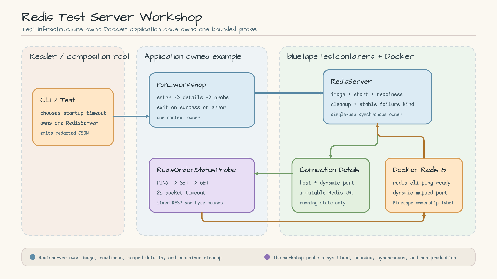
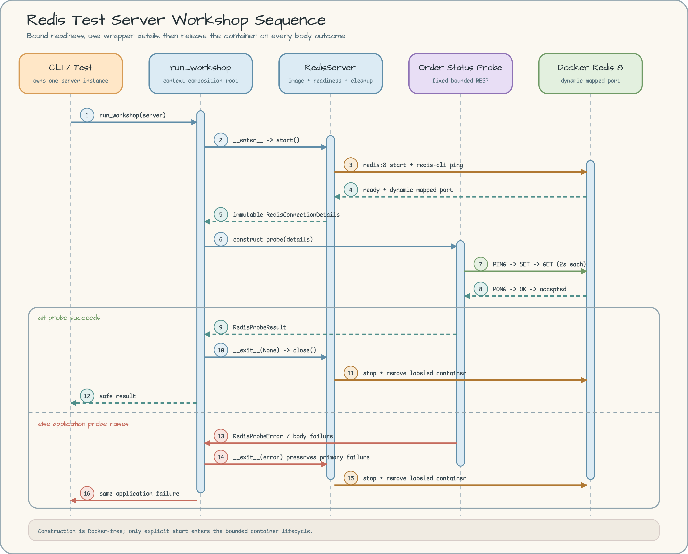

# Redis Test Server Workshop

[English](README.md) | 한국어

Container lifecycle은 ecosystem이 제공하는 `RedisServer`에 맡기고,
애플리케이션은 고정되고 제한된 order-status probe 하나만 소유하는 Docker-backed
integration-test 예제입니다.

## Scenario

주문 서비스의 integration test에서 실제 Redis process가 필요합니다. 테스트는
readiness를 기다리고, 동적으로 매핑된 endpoint를 얻고, 최소 애플리케이션 round
trip을 검증한 뒤 애플리케이션 코드가 실패해도 container를 정리해야 합니다.

이 예제는 `ORD-1001`에 대해 `PING`, `SET`, `GET`을 수행합니다. Production Redis
client를 만드는 예제가 아닙니다.

- `RedisServer`가 `redis:8`, image 확보, container 시작, `redis-cli ping`
  readiness, dynamic port mapping, cleanup을 소유합니다.
- `run_workshop()`이 server context 하나를 소유하고 server가 실행된 뒤에만
  `RedisConnectionDetails`를 읽습니다.
- `RedisOrderStatusProbe`는 2초 socket timeout과 고정 byte limit을 적용한 private
  RESP subset만 소유합니다.
- `redis-py`, 직접 만든 `GenericContainer`, fixed host port, 공유 global fixture,
  retry loop, production Redis cache/provider를 추가하지 않습니다.

## Architecture

[](docs/images/architecture.svg)

Wrapper와 애플리케이션의 책임은 다릅니다. 애플리케이션은 Redis URL이나 container
설정을 다시 만들지 않고 실행 중인 wrapper가 반환한 immutable details를 사용합니다.
Probe는 image를 선택하거나 임의 명령을 보낼 수 없습니다.

## Sequence Diagram

[](docs/images/sequence.svg)

객체 생성은 deterministic하며 Docker에 접근하지 않습니다. Context에 진입할 때만
제한된 lifecycle을 시작합니다. 성공 및 body 실패 경로는 모두 `close()`를 호출합니다.
Cleanup도 실패하면 wrapper는 원래 body 실패를 보존하고 container reference를
유지하므로 같은 객체에서 `close()`를 다시 호출할 수 있습니다.

## Ownership and limits

| Owner | Contract |
| --- | --- |
| Caller / test | single-use server 하나를 만들고 신뢰할 수 있는 `startup_timeout` 설정을 선택합니다. |
| `RedisServer` | image, Docker start, bounded readiness, mapped details, stable failure kind, cleanup을 소유합니다. |
| `run_workshop()` | 성공과 실패 모두에서 server context 하나에 정확히 한 번 진입하고 빠져나옵니다. |
| `RedisOrderStatusProbe` | 정확한 `RedisConnectionDetails`를 받고 고정 order key의 `PING` / `SET` / `GET`만 허용합니다. |
| Docker lane | 순차 실행하며 parallel container launch나 공유 server owner가 없습니다. |

CLI의 `startup_timeout`은 30초입니다. 애플리케이션 명령은 각각 2초 socket timeout을
사용합니다. Order ID는 ASCII 48 byte, status와 RESP command part/bulk response는
64 byte, response line은 128 byte로 제한합니다.

## Prerequisites and setup

- CPython 3.13.14
- uv 0.11.28
- 명시적 Docker 명령에만 필요한 Docker-compatible runtime
- 신뢰할 수 있는 `redis:8` image 접근

저장소 root에서 실행합니다.

```bash
uv sync --locked --python 3.13.14
```

Request, pull request payload 등 신뢰할 수 없는 입력으로 image override를 선택하지
마세요. Image reference는 실행 가능한 test infrastructure입니다.

## Run deterministic tests without Docker

기본 경로는 등록된 `testcontainers` marker를 제외합니다.

```bash
uv run --locked pytest -m "not testcontainers" \
  examples/redis_test_server/tests -q
```

이 테스트는 Docker 없이 unstarted/terminal lifecycle, trusted configuration,
protocol limit, timeout/error context, redacted CLI failure와 성공/실패 context ownership을
scripted socket과 server로 검증합니다.

## Run the Docker integration test

Docker-backed 작업은 sequential(순차) 방식으로 실행합니다.

```bash
uv run --locked pytest -m testcontainers \
  examples/redis_test_server/tests/test_redis_integration.py -q
```

실제 readiness, dynamic `RedisConnectionDetails`, `PING` / `SET` / `GET`, 성공 후
cleanup, 애플리케이션 body 실패 후 cleanup, 새 server의 fresh state를 검증합니다.

## Run the example

```bash
uv run --locked python -m examples.redis_test_server
```

예상 출력:

```json
{"event":"redis_workshop_succeeded","order_id":"ORD-1001","ping_succeeded":true,"read_succeeded":true,"status":"accepted","write_succeeded":true}
```

성공 event에는 address나 container identifier가 없습니다. Startup과 probe 실패는
redacted JSON을 출력하고 exit status 1을 반환합니다.

## Failure and cleanup

`TestcontainerStartError.kind`는 raw daemon/registry 진단 정보를 노출하지 않고 다음
stable `StartFailureKind` 중 하나를 제공합니다.

- `runtime-unavailable`
- `image-pull`
- `readiness-timeout`
- `wrapper-failure`

Runtime 상태는 `docker info`로 따로 확인하세요. Python process가 비정상 종료됐다면
무언가를 제거하기 전에 Bluetape label이 붙은 resource를 확인합니다.

```bash
docker ps -a --filter label=com.bluetape.testcontainers.redis=true
```

현재 workshop run의 container라고 확인한 ID만 제거합니다.

```bash
docker rm -f <confirmed-container-id>
```

정상 종료 과정에서 cleanup 실패가 발생하면 원래 exception을 보존하고 같은
`RedisServer`에서 `close()`를 다시 호출하세요. Label inspection을 운영 근거로
사용하되, image 이름만 보고 관련 없는 container를 제거하면 안 됩니다.

## Source map

- [`probe.py`](probe.py) — immutable result, safe failure, bounded fixed RESP flow.
- [`application.py`](application.py) — server context 단일 owner.
- [`__main__.py`](__main__.py) — Docker-backed composition과 redacted JSON.
- [`test_application.py`](tests/test_application.py) — deterministic lifecycle 및 CLI 계약.
- [`test_probe.py`](tests/test_probe.py) — protocol, limit, causal error 테스트.
- [`test_redis_integration.py`](tests/test_redis_integration.py) — 순차 real Redis 검증.

## Non-goals

이 workshop은 production Redis authentication, TLS, pooling, pipelining, retry,
cluster/sentinel discovery, distributed coordination, cache semantics, generic command
API를 제공하지 않습니다. 이런 요구 사항에는 지원되는 production Redis client와
애플리케이션별 보안 정책을 사용하세요.
